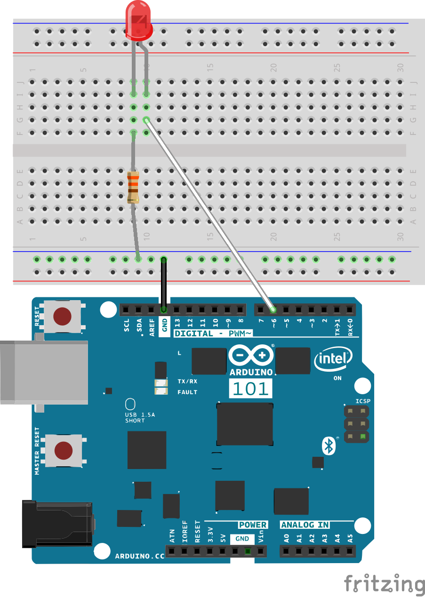
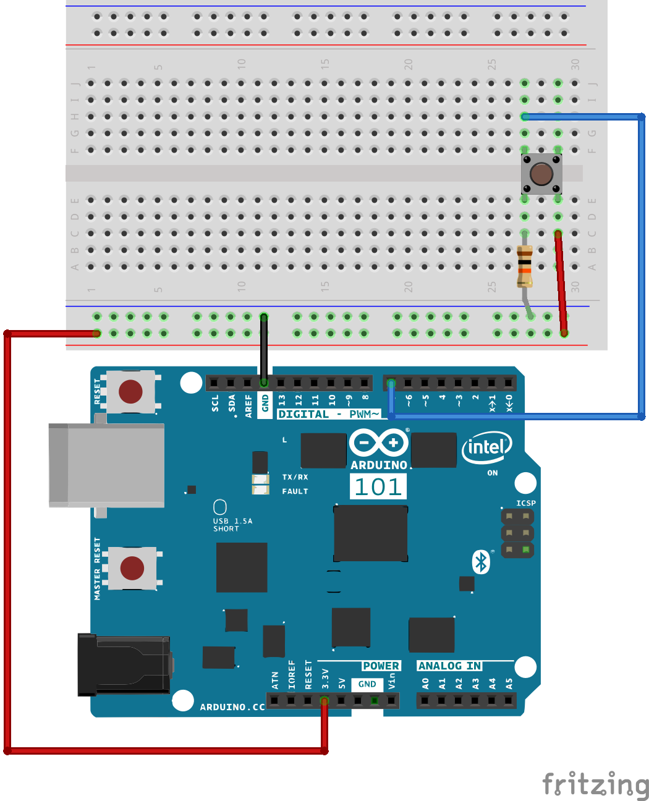
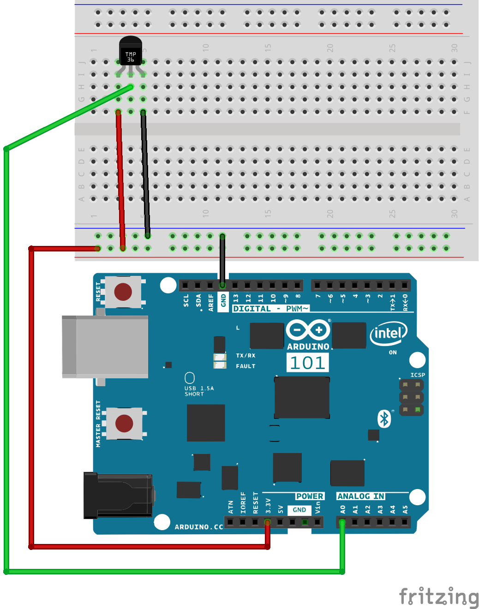

Use the [Arduino IDE](https://www.arduino.cc/en/Main/Software) and an [Arduino 101](http://www.microcenter.com/product/460273/Arduino_101_with_Intel_Curie) to build this Bluetooth Hardware.

[LED.ino](LED/LED.ino) emulates the SmartBotics lightbulb.

[Button.ino](Button/Button.ino) emulates the button service from the [TI CC2650 SensorTag](ti.com/sensortag).

[Thermometer.ino](Thermometer/Thermometer.ino) uses a [TMP36](https://www.adafruit.com/product/165) analog temperature sensor and provides a custom temperature service.

